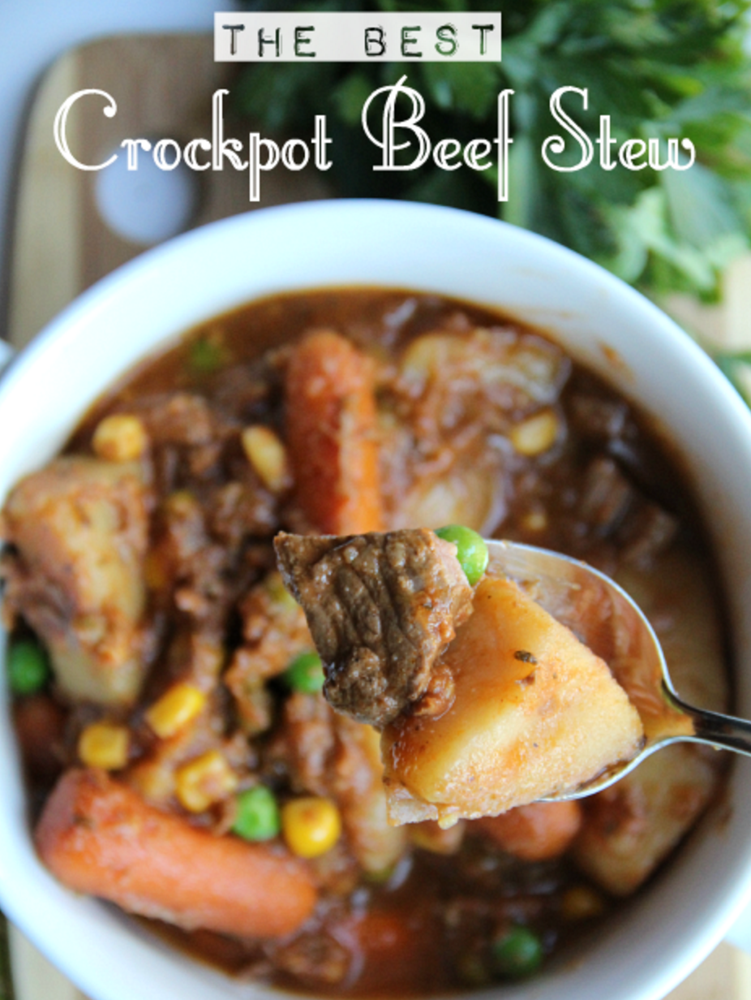

# Slow Cooker Beef Stew

[Best Crockpot Beef Stew](http://www.familyfreshmeals.com/2013/10/best-crockpot-beef-stew.html)

## Timing

|   Prep time   |   Cook time   |    Total time     |
|:-------------:|:-------------:|:-----------------:|
|    10 mins    |   10 hours    |  10 hours 10 mins |

## Ingredients

At the beginning:

* 2 pounds beef stew meat, (cut into bite-sized pieces)
* 1 tsp Salt
* 1 tsp pepper
* 1 medium onion, finely chopped
* 2 celery ribs, sliced
* 2-3 cloves of garlic, minced
* 6oz can tomato paste
* 32oz beef broth
* 2 Tablespoons Worcestershire sauce
* 2 cups baby carrots carrots
* 4-5 small red potatoes,cut into bite-sized pieces (about 3 cups)
* 1 tablespoon dried parsley
* 1 teaspoon oregano

30 minutes before serving:

* 1 cups frozen peas
* 1 cup frozen corn
* 1/4 cup flour
* 1/4 cup water

## Directions

1.  Combine beef, celery, carrots, red onion, potatoes, salt,  pepper, garlic, parsley, oregano, Worcestershire sauce, beef broth, and tomato paste in the crock pot. I used a 6 qt crockpot for this stew.  Cook on LOW for 10 hours or on HIGH for 6-7 hours.

2.  About 30 minutes before serving, mix the flour and the water together in a small dish and pour into the crockpot. Mix until well combined. This will add a nice thickness to the stew. Next add in your frozen peas and corn. Continue cooking covered for 30 minutes.
