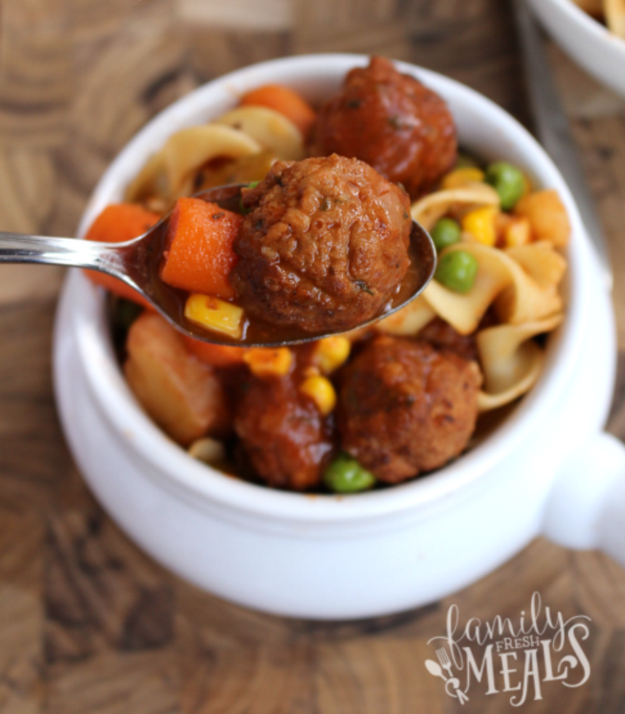

# Easy Crockpot Meatball Stew

[Easy Crockpot Meatball Stew](http://www.familyfreshmeals.com/2015/10/easy-crockpot-meatball-stew.html)

## Timing

|   Prep time   |   Cook time   |   Total time    |
|:-------------:|:-------------:|:---------------:|
| 15 mins       | 5 hours       | 5 hours 15 mins |

## Ingredients:

At the beginning:

* 2 pounds frozen meatballs
* 1 tsp Salt
* 1 tsp pepper
* 1 medium onion, finely chopped
* 2 celery ribs, sliced
* 2-3 cloves of garlic, minced
* 6oz can tomato paste
* 32oz beef broth
* 2 Tablespoons Worcestershire sauce
* 2 cups baby carrots carrots
* 4-5 small red potatoes,cut into bite-sized pieces (about 3 cups)
* 1 tablespoon dried parsley
* 1 teaspoon oregano

30 minutes before serving:

* 1 cups frozen peas
* 1 cup frozen corn
* 2 cups of cooked pasta

## Directions

1. Combine meatballs, celery, carrots, red onion, potatoes, salt, pepper, garlic, parsley, oregano, Worcestershire sauce, beef broth, and tomato paste in the crockpot. I used a 6 qt crockpot for this stew. Cooked on HIGH for 4-5 hours or LOW for 7-8.

2. About 15 minutes before serving, add in your cooked noodles, frozen peas and corn. Continue cooking covered for 30 minutes.

